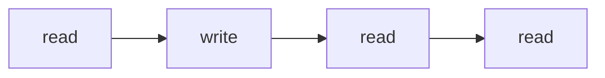
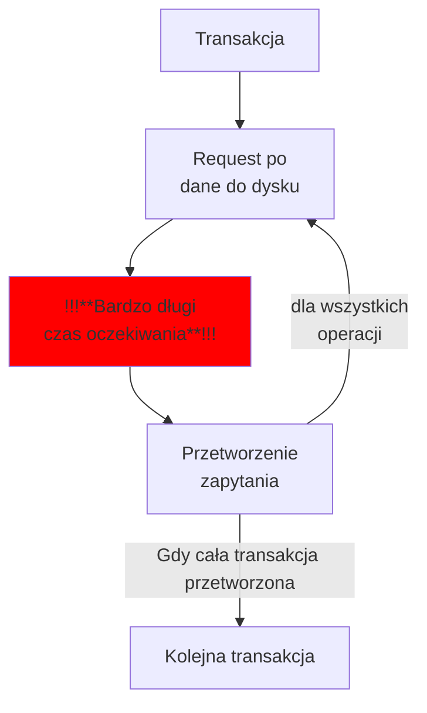

# Transakcja (Bazy danych)
Interaktywna sesja z bazą danych obejmująca ciąg operacji który kończymy zatwierdzeniem **commit** lub cofnięciem **rollback**

## Po co?
Zabezpiecza operacje na bazie danych przed awariami systemu, oraz umożliwia współbieżne wykonywanie
**Kontakt z bazą danych jest obarczony ryzykiem**
- przez awarie
- przez zmiany danych przez innych użytkowników
- przez złamanie logiki biznesowej

## ACID
- Atomowość (*Atomicity*)
- Spójność (*Consistency*)
- Izolacja (*Isolation*)
- Trwałość (*Durability*)

### Atomowość
Wyzwaniem jest awaria systemu, musimy zapewnić że tylko cała operacja się wykona, nie będzie połowicznych zmian
### Spójność
Po zakończeniu operacji baza musi być spójna (nie może łamać więzów oraz zasad logiki biznesowej) (To zapewnia programista)
### Izolacja
Transakcja ma pozornie bazę na wyłączność, czyli danych na których operujemy nie może nikt inny modyfikować
### Trwałość
Po sukcesie transakcji (po operacji *commit*) gwarantujemy że tych zmian nie cofniemy

## Różne hasła dotyczące wydajności systemu
- **Throughput** 
przepustowość sytemu czyli 
prędkość przetwarzania
- **Response time** 
	czas oczekiwania na zakończenie transakcji (czy to nie to samo co throuhgput? #doubt)
- **Resource utilisation**
	czy dobrze wykorzystujemy czas działania procesora

## Przeplot
Traktujemy transakcje jako ciąg operacji *read* oraz *write*

Rozważamy przeploty takich ciągów dla wielu transakcji

Przykład

```mermaid
graph LR

subgraph Przeplot 2
p2t2r1[Read] --> 
p2t2w1[Write] --> p2t1r2[Read] -->
p2t1r1[Read] 
end

subgraph Przeplot 1
t1r1[Read] --> 
t2r1[Read] --> 
t2w1[Write] --> 
t1r2[Read] 
end


subgraph transakcje
t1(Transakcja 1)
t2(Transakcja 2)
end

style t1 fill:#124312
style t2 fill:#224466
style t1r1 fill:#124312
style t2r1 fill:#224466
style t1r2 fill:#124312
style t2w1 fill:#224466
style p2t1r1 fill:#124312
style p2t2r1 fill:#224466
style p2t1r2 fill:#124312
style p2t2w1 fill:#224466

```

## Obsługa przerwań
Co powinniśmy robić podczas rollbacku transakcji?

Załóżmy że mamy następujący scenariusz

- Transakcja 1 modyfikuje zawartość A
- Transakcja 2 odczytuje wartość A
- Transakcja 2 - commit
- Transakcja 1 - rollback

Mamy katastrofe, taki przeplot sprawia że Transakcja 1 mogła podjąć jakieś decyzje na podstawie rzeczy których nie ma w bazie danych, jest to nienaprawialny błąd.

Więc wprowadzamy następujące pojęcie

### Recoverability
> Przeplot jest *recoverable* jeżeli każda transakcja która widziała jakąś modyfikacje zasobu $A$, zakończy się dopiero po zakończeniu transakcji która zmodyfikowała zasób $A$

Dzięki temu jeżeli modyfikująca transakcja się przerwie to możemy przerwać także wszystkie transakcje które widziały jej zmiany.

Takie kaskadowe zrywanie jest bardzo drogie (każdą zerwaną transakcje trzeba potem wykonać od nowa), więc nie chcielibyśmy żeby takie sytuacje się zdarzały.

Wprowadźmy więc drugie pojęcie

### Cascadeless recoverability
> Przeplot jest *cascadeless recoverable* jeżeli wszystkie transakcje czytają wyłącznie zacommitowane dane

Jeżeli dopuszczamy tylko takie przeploty to nie musimy już propagować żadnego przerwania transakcji

## Szeregowalność

### Uszeregowanie przeplotu
*Uszeregowanie (Serializacja) przeplotu to taki przeplot w którym wszystkie transakcje dzieją się po kolei i efekt jest taki sam*

W analizach przeplotu będziemy sprawdzać czy przeplot jest szeregowalny

Jeżeli przeplot ma taki sam efekt jak wykonanie po kolei to znaczy że na pewno będzie miał poprawny efekt

**Będziemy chcieli dopuszczać podczas wykonania tylko te przeploty które są szeregowalne**

(Podobno w programowaniu współbierznym też się wykorzystuje takie kryterium poprawności, ale chyba nie było tego na wykładzie z PW??? #todo sprawdzić, zalinkować)

---
Niestety sprawdzenie czy transakcje są szeregowalne jest zbyt trudne, ponieważ to wszystko zależy od tego jak wyliczą się skomplikowane zapytania z sqla.

Potrzebujemy łatwiejszej do obliczenia metody
(Takiej która nie musi dopuścić wszystkich dobrych przeplotów, ale jest dużo szybsza to obliczenia)

Nasza metoda będzie sprawdzać tylko z jakiego typu operacjami mamy doczynienia (**Read** lub **Write**), oraz na jakich **Elementach** operują, możemy wprowadzić kilka kolejnych definicji

---

### Konflikt operacji
Dwie operacje  są w konflikcie jeżeli 
-  dotyczą tego samego elementu 
-  przynajmniej jedna jest zapisem

```mermaid
graph LR

r["Read(A)"] --> w["Write(A)"]

style r fill:#124312
style w fill:#224466
```

Zmiana kolejności wykonywanie odczyt-zapis lub  zapis-zapis może mieć wpływ na wynik, dlatego jest to konflikt

Teoretycznie zmiana kolejności odczy-zapis lub zapis-zapis nie musi zmienić wartości (np. wtedy gdy zapisujemy to samo co było) 
Ale żeby to sprawdzić musielibyśmy obliczyć wartość zapytania, a tego nie jesteśmy w stanie zrobić wystarczająco szybko

### Bezkonflikowa szeregowalność
Przeplot jest *bezkonfliktowo szeregowalny* jeżeli można go uszeregować zamieniając kolejnością **sąsiednie** operacje (**z różnych transakcji**) które nie są w konflikcie

Przykład
![[Pasted image 20210113060619.png]]

Każda zamiana jest usprawiedliwiona tym że operują na różnych zasobach

Po zamianach kończymy z twoma rozdzielnymi transakcjami, najpierw 1 (zielone) a potem 2 (niebieskie)

Ten algorytm jest prawidłowy dlatego że każda taka zamiana nie może zmienić efektu transakcji, czyli ciąg takich operacji też go nie zmieni.

---
Ale dlaczego jest to łatwo obliczalne? Jak narazie wygląda jakby szukanie takiego prawidłowego ciągu zamian było trudne

### Algorytm sprawdzania bezkonfliktowej szeregowalności przeplotu
![[Pasted image 20210113063318.png]]
[[Porządek topologiczny grafu]]

#### Dlaczego to działa?

Graf precedencji reprezentuje kolejność w jakiej muszą się wykonać transakcje
Jeżeli $T_i \rightarrow T_j$ to znaczy że transakcja $T_i$ musi się wykonać przed $T_j$.

---
Dlaczego?

Ponieważ jeżeli jakaś operacja $A$ z transakcji $T_i$ jest w konflikcie z późniejszą operacją $B$ transakcji $T_j$ to znaczy że nigdy nie będziemy w stanie zamienić kolejnością tych dwóch operacji. 

Ale żeby tak uszeregować przeplot żeby $T_j$ była przed $T_i$ musielibyśmy w szczególności zamienić $A$ z $B$

Czyli musimy tak serializować przeplot żeby  cała transakcja $T_i$ była przed $T_j$

---

Dlaczego brak cykli w tym grafie wystarcza?
Nie było na wykładzie :(

No dobrze, mamy algorytm, ale jednak nas jako systemu bazodanowego nie interesuje po prostu sprawdzanie przeplotów, tylko raczej generowanie poprawnych przeplotów, które będą jak najbardziej efektywne, tym zajmuje się właśnie [[#Scheduler]]

## Metody implementacji systemu transakcji

### Implementacja naiwna
- Wrzucamy transakcje na [[kolejka (struktura danych)|kolejkę]]
(zapewniamy [[#Izolacja]])
 
- Operujemy na kopii danych, a po *commit* podmieniamy całość (zakładamy że system będzie w stanie podmienić dane w jednym kroku) 
(zapewniamy [[#Atomowość]])

To mało efektywne rozwiązanie, wykonujemy tylko jedną transakcje jednocześnie, a zapytanie po dane z dysku jest bardzo wolne

related: [[Komunikacja procesora z dyskiem twardym jest bardzo wolna]]

W tym odcinku bohaterowie jadą do dysku ciężarówką, trzeba sobie tak 

Model działania transakcji w naiwnej implementacji

Jako że transakcje mogą korzystać z innych części danych to powinniśmy umożliwić jednoczesne robienie requestów po dane z dysku 

### Lepsze implementacje
Gdy chcemy zapewnić współbieżność systemu to zwykle implementujemy oddzielnie
#### Recovery system 
zapewnia [[#Trwałość]] i [[#Atomowość]]
#### Concurrency-control system 
zapewnia [[#Izolacja]]

Implementacje [[#Concurrency-control system]] są dużo ciekawsze, więc tym  się zajmiemy.
### Scheduler
Zajmuje się generowaniem przeplotów wpływających do systemu transakcji

Generuje przeploty w taki sposób żeby zapewnić [[#Bezkonflikowa szeregowalność]] oraz [[#Cascadeless recoverability]] używając protokołu [[#Two-phase locking]]

#### Blokady
![[Pasted image 20210113074017.png]]

#### Two-phase locking
W trakcie działania najpierw blokujemy napotkane zasoby, jeżeli musimy czekać na blokadę to po prostu wrzucamy operacje na kolejke
Następnie gdy już wiadomo że nie będziemy próbować niczego zablokować to możemy zacząć zwalniać, ten mechanizm zapewnia [[#Bezkonflikowa szeregowalność]]

Dlaczego?
#todo 

Jest też możliwość deadlocka
![[Pasted image 20210113081436.png]]
Scheduler musi sobie z tym poradzić
##### Obsługa zakleszczenia
Generalnie chcemy zabijać młodsze transakcje, żeby nie tracić czasu wykonania.

Są dwa warianty obsługi
- Wait-Die: młodsza jest zabijana kiedy prosi o blokade starszej
- Wound-Die: gdy starsza prosi o blokade na której jest młodsza, to młodsza jest zabijana

Jest jeszcze opcja żeby mieć dodatkowy proces który co jakiś czas będzie sprawdzać czy jest zakleszczenie, sprawdzając czy jest cykl w grafie.

Taki proces wybiera odopwiednią transakcje do zabicia na podstawie minimalnego kosztu, można go wyliczać na różne sposoby (czas wykonywania, ilość locków, itp)

Trzeba uważać dla zagłodzenie, więc możemy do kosztu wliczać ilość rollbacków.

##### Strict two-phase locking
Zwalniać możemy zacząć dopiero gdy zrobimy commit lub rollback, wtedy zapewniamy [[#Cascadeless recoverability]] 

Dlaczego tak?

Jeżeli zwalniamy po zakończeniu całej transakcji to na pewno nikt nie przeczyta naszych edycji
